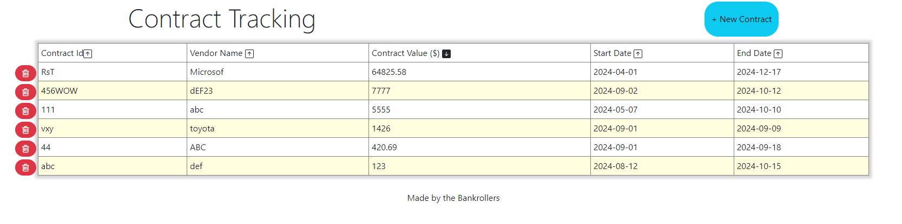

# Contract Tracking by the Bankrollers

## Deployed application
[Deployed application - https://eslickjr.github.io/Bankroll/](https://eslickjr.github.io/Bankroll/)

## Task

In this project, we will create a two page website where users will input and view contracts. The 'main' index.html page will render a list of contracts that they are tracking from local storage. The analyst will be able to sort the table in ascending/descending order by clicking on a column header. The analyst can add contracts to the table by clicking a button that takes them to the form.html page. The analyst can then fill in the information on the form and submit the new contract. If the analyst does not want to create a new contract, they can simply return to the main page by clicking a back button. The analyst should also have the ability to delete a contract and remove it from local storage.

## User Story

As a financial analyst, I want to be able to create a list of contracts that my company has with suppliers so that I can help my business partners set budgets and forecast expenses.

## Acceptance Criteria

```md
GIVEN a list of contracts
WHEN I load the app,
THEN I am sent to that Contract Tracking page that contains a sortable table with a Contract ID, Vendor Name, Contract Value ($), Start Date, and End Date
WHEN there are no contracts in my list
THEN the console fires a message indicating that there are no contracts in local storage
WHEN there are contracts in the list 
THEN I can sort the contracts in ascending/descending order by clicking on the column header
WHEN I want to enter a new contract I can by clicking on a 'New Contract' button
THEN I am routed to the Contract Input Form page
WHEN I enter new contract information
THEN data validation checks are performed on all of the fields
WHEN I want to submit a contract
THEN I am asked to confirm
WHEN I do not want to create a new contract
THEN I can click on the back button and return to the Contract Tracking page
WHEN I want to delete a contract
THEN I can by clicking on the delete button next to the row that I want to delete
```


## Description and Features
This application will allow an analyst to create a list of contracts to help them create and forecast budgets for their business partners. The analyst can add contracts to the list by clicking the '+ New Contract' button at which point they are taken to the Contract Input Form page. On this page they can enter an alphanumeric Contract ID, and alphanumeric Vendor name, a positive Contract Value number limited to two decimal places, a Start Date for the contract, and an End date for the contract that cannot be before the Start Date. The form will also check that data has been entered into every field. Once the analyst clicks 'Submit', they app will ask for confirmation that they want to create the contract. After the analyst approves, they should be taken back to the Contract Tracking page and see their new contract added to the bottom of the table.

The analyst should be able to delete any contract if they wish by clicking the trash can icon next to the contract that they would like to delete. When they click the trash can icon, a modal should fire asking the analyst to confirm the deletion. The analyst should also be able to sort the table of contracts by clicking on the column header. The arrow icon next to the column header name will indicate if the table is sorted in ascending/descending order. The picture below shows a list of contracts sorted in descending order by value.



## Credits
Jaymeson White
Joshua Eslick
Ryan Schwark
Shirisha Korukonda Bhattaru

This code also uses https://getbootstrap.com/, https://sweetalert2.github.io/, and https://fontawesome.com/

## License

MIT License

Copyright (c) 2024 Ryan Schwark

Permission is hereby granted, free of charge, to any person obtaining a copy
of this software and associated documentation files (the "Software"), to deal
in the Software without restriction, including without limitation the rights
to use, copy, modify, merge, publish, distribute, sublicense, and/or sell
copies of the Software, and to permit persons to whom the Software is
furnished to do so, subject to the following conditions:

The above copyright notice and this permission notice shall be included in all
copies or substantial portions of the Software.

THE SOFTWARE IS PROVIDED "AS IS", WITHOUT WARRANTY OF ANY KIND, EXPRESS OR
IMPLIED, INCLUDING BUT NOT LIMITED TO THE WARRANTIES OF MERCHANTABILITY,
FITNESS FOR A PARTICULAR PURPOSE AND NONINFRINGEMENT. IN NO EVENT SHALL THE
AUTHORS OR COPYRIGHT HOLDERS BE LIABLE FOR ANY CLAIM, DAMAGES OR OTHER
LIABILITY, WHETHER IN AN ACTION OF CONTRACT, TORT OR OTHERWISE, ARISING FROM,
OUT OF OR IN CONNECTION WITH THE SOFTWARE OR THE USE OR OTHER DEALINGS IN THE
SOFTWARE.

---
